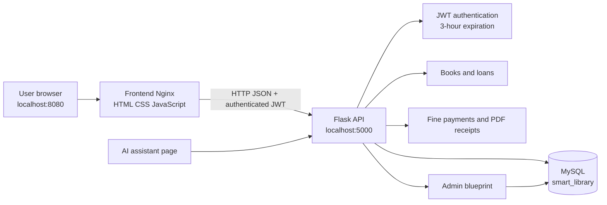
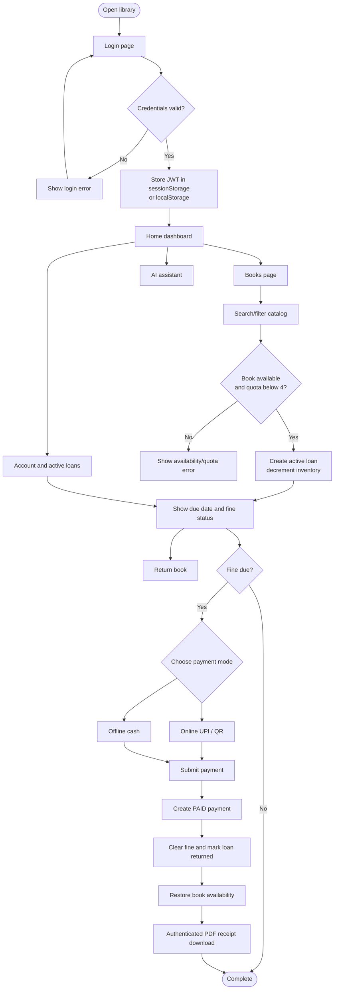
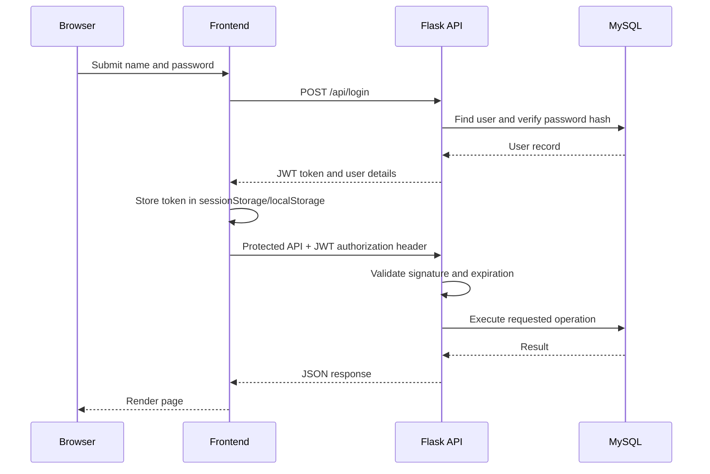

# AI Smart Library Management System

An authenticated digital library platform with book discovery, smart search, borrowing limits, overdue fines, online/offline fine clearance, PDF receipts, an AI assistant, and administrator management.

## Features

- User registration, login, forgot-password flow, JWT sessions, and logout.
- Three-hour JWT sessions with protected API and direct-page access.
- Book catalog, category/language filters, ISBN search, autocomplete, and smart multi-word search.
- Borrowing for 2–10 days with a maximum of four active loans per user.
- Automatic overdue calculation and fine calculation at ₹50 per overdue day after the 10-day grace period.
- UPI/QR and offline cash fine-payment choices.
- Automatic payment clearance, loan return, inventory restoration, and PDF receipt download.
- Admin dashboard for users, books, loans, payments, resets, and activity.
- Docker-ready frontend and backend images.
- GitHub Actions workflows for syntax checks, image builds, health checks, and cleanup.

## System architecture



## End-to-end workflow



## Authentication and protected requests



Public API endpoints are `/api/login`, `/api/register`, and `/api/forgot-password`. Other `/api/*` endpoints require a valid JWT authorization token. The frontend validates a session before rendering protected pages and redirects invalid sessions to `/`.

## Borrowing and fine rules

1. A user chooses a borrowing period from 2 through 10 days.
2. The API checks that the book is available, the user has fewer than four active loans, and the same book is not already borrowed.
3. A loan is created and `books.available_quantity` is decremented.
4. The API reports due date, remaining days, overdue days, and fine.
5. Fine calculation is `max(days since borrowed - 10, 0) * ₹50`.
6. A successful fine payment creates a `PAID` record, returns the loan, and increments availability.

## Payment and receipt workflow

```mermaid
flowchart LR
    Loan[Active overdue loan] --> Choose[Choose UPI or cash]
    Choose --> Post[POST /api/fine-payments]
    Post --> Validate[Validate JWT, loan owner,<br/>amount, and payment method]
    Validate --> Insert[Insert PAID payment]
    Insert --> Return[Set returned_at]
    Return --> Stock[Restore available_quantity]
    Stock --> ID[Return receipt_id]
    ID --> Fetch[Authenticated GET<br/>/api/fine-payments/{id}/receipt]
    Fetch --> PDF[Generate PDF response]
    PDF --> Download[Browser downloads receipt]
```

Receipt downloads must include the JWT authorization header. The frontend fetches the PDF as a blob and creates a download link; opening the API URL directly in a new tab does not include the token.

## Project structure

```text
.
├── backend/
│   ├── app.py                 # Flask app, auth, loans, payments, receipts
│   ├── books.py               # Book blueprint
│   ├── admin.py               # Admin blueprint
│   ├── auth.py                # Authentication helpers
│   ├── requirements.txt
│   └── Dockerfile
├── frontend/
│   ├── login.html             # Login
│   ├── register.html          # Registration
│   ├── index.html             # User dashboard
│   ├── books.html             # Catalog and borrowing
│   ├── admin.html             # Admin dashboard
│   ├── ai.html                # AI assistant
│   ├── *.js                   # Page behavior and session handling
│   ├── style.css
│   ├── nginx.conf
│   └── Dockerfile
└── .github/workflows/
    ├── smart-library-cicd.yml
    ├── ci-cd.yml
    └── mysql.yml
```

See [backend/README.md](backend/README.md) and [frontend/README.md](frontend/README.md) for component-specific details.

## Configuration

Backend environment variables:

| Variable | Default | Purpose |
|---|---|---|
| `DB_HOST` | `localhost` | MySQL host |
| `DB_PORT` | `3306` | MySQL port |
| `DB_NAME` | `smart_library` | Database name |
| `DB_USER` | `library_user` | Database user |
| `DB_PASSWORD` | Set privately | Database password; never commit it |
| `JWT_SECRET` | Set privately | JWT signing secret; never commit it |
| `JWT_EXPIRATION_HOURS` | `3` | Session lifetime |

## Run locally

### Backend

```powershell
cd backend
python -m venv .venv
.venv\Scripts\Activate.ps1
pip install -r requirements.txt
$env:DB_HOST="localhost"
$env:DB_PORT="3306"
$env:DB_NAME="smart_library"
$env:DB_USER="library_user"
$env:DB_PASSWORD="<your-database-password>"
$env:JWT_SECRET="<your-private-jwt-secret>"
python app.py
```

The API runs at `http://localhost:5000`.

### Frontend

Serve `frontend/` with any static web server. The included Nginx image is the recommended deployment path:

```powershell
cd frontend
docker build -t smart-library-frontend .
docker run --rm -p 8080:80 smart-library-frontend
```

Open `http://localhost:8080/`. The root route serves `login.html`.

### Existing Docker deployment

The normal deployment uses:

- `smart-library-mysql` on port `3306`
- `smart-library-backend` on port `5000`
- `smart-library-frontend` on port `8080`

Keep the MySQL volume when rebuilding application containers so library data is preserved.

## API overview

| Area | Endpoint examples | Auth |
|---|---|---|
| Health | `GET /api/health` | Public |
| Auth | `POST /api/login`, `/api/register`, `/api/forgot-password` | Public |
| Books | `GET /api/books`, `POST /api/books`, `PUT/DELETE /api/books/{id}` | JWT; admin for management |
| Borrowing | `POST /api/borrow`, `GET /api/my-loans`, `POST /api/loans/{id}/return` | JWT |
| Payments | `POST /api/fine-payments` | JWT |
| Receipt | `GET /api/fine-payments/{payment_id}/receipt` | JWT |
| Admin | `/api/admin/dashboard`, users, loans, payments, books | Admin JWT |

## Validation

```powershell
python -m py_compile backend\app.py backend\books.py backend\admin.py backend\auth.py
```

The CI workflow also builds both Docker images and checks frontend/backend container health.

## Security notes

- Use a strong, private `JWT_SECRET` outside development.
- Do not commit database passwords or production credentials.
- Keep payment and receipt requests authenticated.
- Passwords are stored as Werkzeug password hashes, never plaintext.
- The sample QR payment address is a development value and must be replaced before production.
