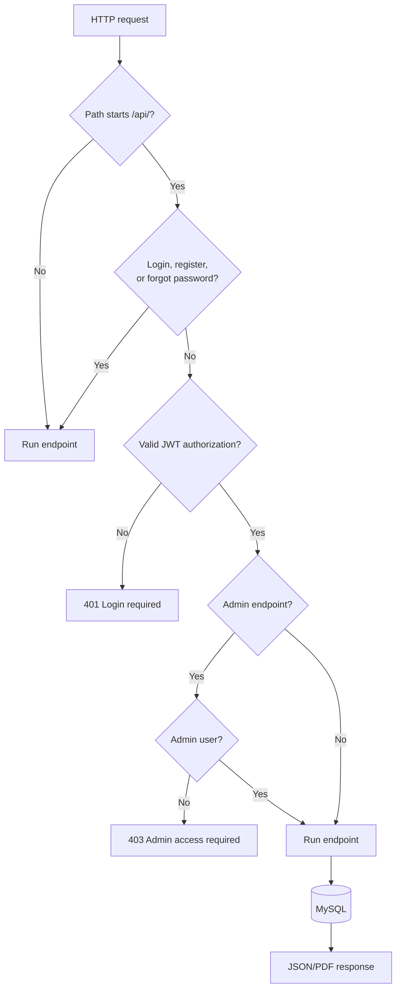

# Backend

The backend is a Flask REST API for authentication, catalog management, borrowing, fines, payments, receipts, and administrator operations.

## Modules

- `app.py`: Flask app, CORS, JWT middleware, authentication endpoints, loans, payments, and PDF receipts.
- `books.py`: Book blueprint and catalog CRUD/search operations.
- `admin.py`: Admin-only dashboard, user, loan, payment, and book operations.
- `auth.py`: Shared authentication helpers.

## Request lifecycle



## Endpoints

### Authentication

- `POST /api/register`
- `POST /api/login`
- `POST /api/forgot-password`

### Books

- `GET /api/books`
- `GET /api/books/{book_id}`
- `GET /api/books/search`
- `POST /api/books`
- `PUT /api/books/{book_id}`
- `DELETE /api/books/{book_id}`

### Loans

- `POST /api/borrow`
- `POST /api/loans` (alias)
- `POST /api/books/{book_id}/borrow` (alias)
- `GET /api/my-loans`
- `GET /api/loans`
- `POST /api/loans/{loan_id}/return`
- `POST /api/return` (legacy-compatible route)

### Payments

- `POST /api/fine-payments`
- `GET /api/fine-payments/{payment_id}/receipt`

The payment endpoint returns `receipt_id`. The receipt endpoint requires the same JWT used for payment and returns `application/pdf`.

## Database behavior

The API uses MySQL Connector/Python. Borrowing and payment operations use transactions:

- Borrowing locks the selected book, validates quota and stock, inserts the loan, then decrements stock.
- Payment inserts a `PAID` record, marks the loan returned, restores stock, and commits all changes together.
- Failed operations roll back the transaction.

## Environment

```text
DB_HOST=localhost
DB_PORT=3306
DB_NAME=smart_library
DB_USER=library_user
DB_PASSWORD=<your-database-password>
JWT_SECRET=<your-private-jwt-secret>
JWT_EXPIRATION_HOURS=3
```

## Run and validate

```powershell
pip install -r requirements.txt
python -m py_compile app.py books.py admin.py auth.py
python app.py
```

Health endpoints:

- `GET http://localhost:5000/health`
- `GET http://localhost:5000/api/health`

The backend Dockerfile exposes port `5000`.
