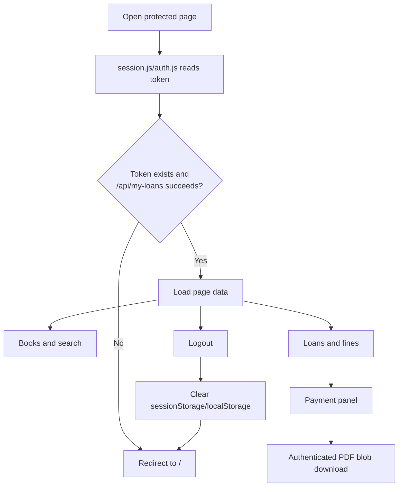

# Frontend

The frontend is a static HTML/CSS/JavaScript application served by Nginx.

## Pages

| Page | Purpose |
|---|---|
| `login.html` | User login |
| `register.html` | Account creation |
| `forgot-password.html` | Password recovery |
| `index.html` | Authenticated user dashboard and active loans |
| `books.html` | Catalog, smart search, borrowing, returns, and payments |
| `ai.html` | AI library assistant |
| `admin.html` | Administrator dashboard |

## Frontend workflow



## Authentication storage

The frontend checks `sessionStorage.library_token` first, then `localStorage.library_token`, then the legacy `localStorage.token` key. Login clears the opposite storage area to prevent stale tokens. Logout clears token and user identity keys before redirecting to `/`.

Protected API requests use:

```http
Authorization: <jwt-token>
```

Receipt downloads must use `fetch()` with this header. A plain `<a href="http://localhost:5000/api/fine-payments/...">` cannot send the JWT authorization token and will return `Login required`.

## Smart search

`books.js` supports:

- title, author, category, language, and ISBN search;
- multi-word matching;
- category and language filters;
- autocomplete suggestions;
- refresh and clear controls.

## Payment UI

The user can choose online UPI/QR or offline cash. After successful payment, the page:

1. Shows payment completion.
2. Displays fine ₹0.
3. Removes the active loan after refresh because the backend returns the book automatically.
4. Offers an authenticated PDF receipt download.

## Run with Nginx

```powershell
docker build -t smart-library-frontend .
docker run --rm -p 8080:80 smart-library-frontend
```

Open `http://localhost:8080/`. `nginx.conf` serves `login.html` at the root and disables caching for HTML, JavaScript, and CSS so updated application code is loaded during development.
